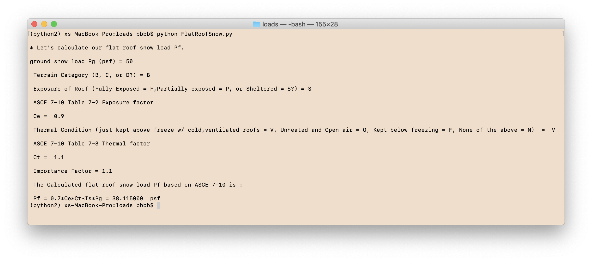

# Engineering Calculators

# Web App

A engineering app for quickly calculating masonry wall lintel under non-bearing conditions. 

*Created using HTML, CSS, Bootstrap & JavaScript.*

# Command Line Interface Programs

A collection of engineering apps for quickly calculating design snow loads, foundation soil bearing pressure, concrete beam and anchor in concrete failure mechanism.

*Created using Python 2.7*

